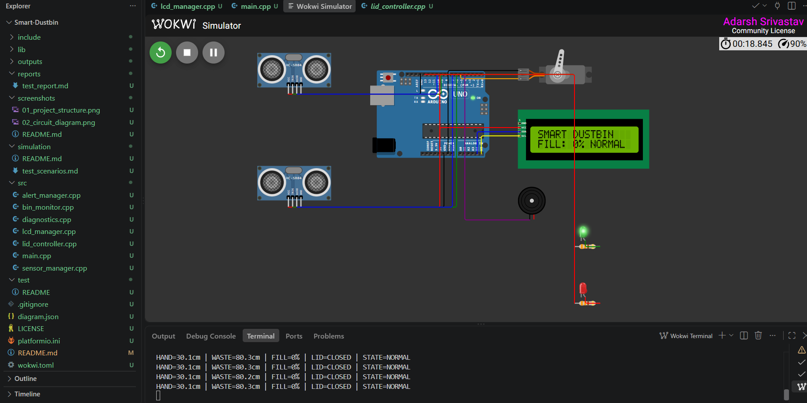
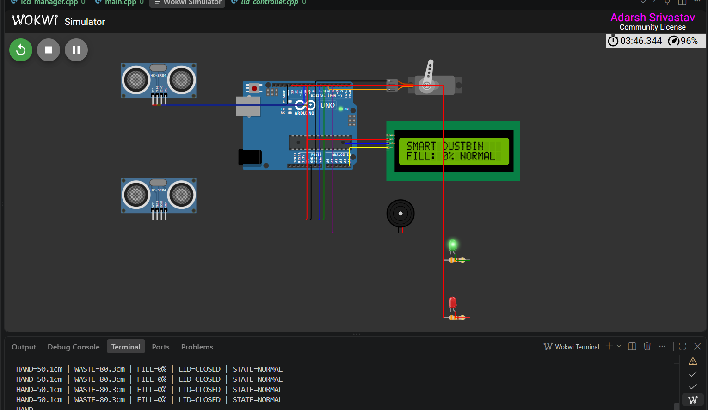
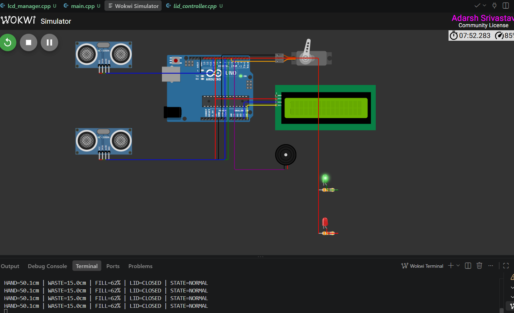
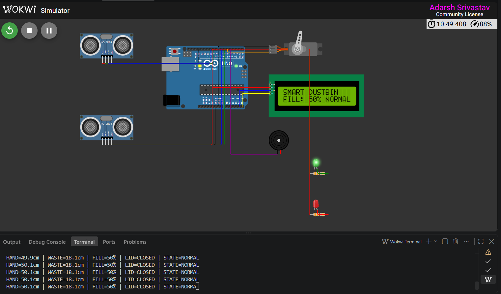
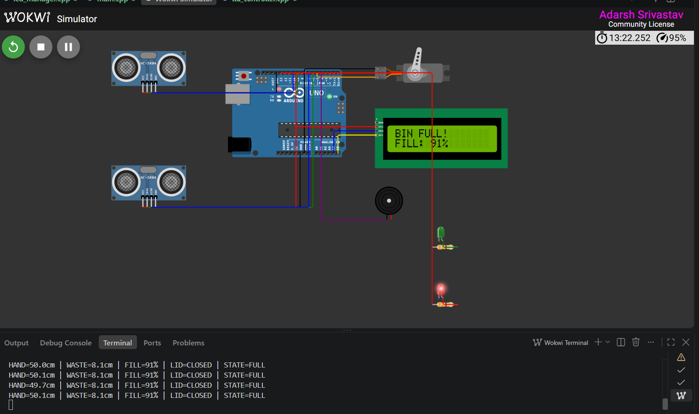
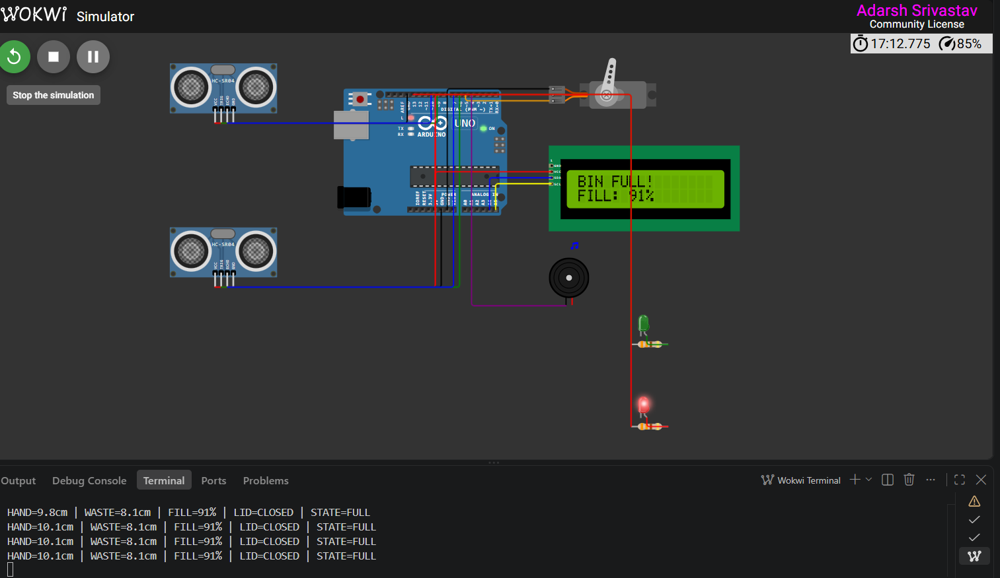
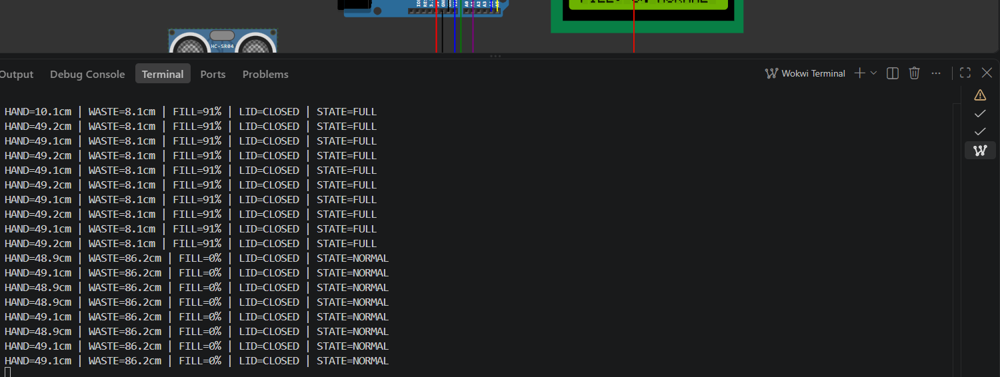

# 🗑️ Smart Dustbin System Using Ultrasonic Sensors, 16x2 LCD, and Microcontroller

> An automated, touchless, dual-sensor smart waste management prototype built with **Arduino UNO / Embedded C++** that automatically detects hand proximity for hands-free lid operation, measures internal waste fill level in real time, displays live telemetry on a 16x2 I2C LCD screen, generates visual/audio alarms, enforces an overflow safety interlock, and transmits continuous diagnostic serial telemetry.

---

## 👨‍💻 Author

**Adarsh Srivastav**  
Computer Science and Engineering (CSE) Student  
Embedded Systems | IoT | Python | AI

---

## 📌 Project Overview

The **Smart Dustbin System Using Ultrasonic Sensors and Microcontroller** is an industry-oriented embedded system prototype designed to address public sanitation, hygiene, and municipal waste management challenges.

Traditional waste containers require physical contact with bin lids or handles, creating major cross-contamination vectors for infectious pathogens in hospitals, public transit hubs, airports, and corporate facilities. Additionally, unmonitored waste bins frequently overflow before custodial staff can inspect them, producing foul odors, environmental pollution, and inefficient manual collection schedules.

This project delivers a dual-sensor autonomous embedded solution with local LCD telemetry:
- **Touchless Proximity Actuation**: An external **HC-SR04 ultrasonic sensor** detects hand or object proximity ($\le 20\text{ cm}$) and actuates an **SG90 servo motor** to open the bin lid automatically for 3 seconds.
- **Real-Time Fill Monitoring**: A second internal downward-facing **HC-SR04 ultrasonic sensor** measures the distance to the accumulated waste surface and calculates the real-time fill percentage ($0\% - 100\%$).
- **Live 16x2 I2C LCD Display**: Real-time bin fill percentage, lid operation status, and critical system warnings are displayed locally on a 16x2 Liquid Crystal Display connected via the I2C bus.
- **Multi-Tiered Alert & Safety Interlock**: When waste capacity reaches or exceeds **90%**, the system activates a **Red warning LED**, shuts off the **Green ready LED**, emits periodic beeps via an **active buzzer**, displays `BIN FULL! LOCK` on the LCD, and engages an **overflow safety interlock** that locks the lid closed to prevent waste spillage.

The complete prototype was developed and validated virtually using **Wokwi** with **Arduino UNO and PlatformIO**, providing practical experience in time-of-flight ultrasonic sensing, I2C communication, GPIO control, PWM motor actuation, state machine scheduling, non-blocking timers, serial telemetry debugging, and technical documentation.

> **Project Note:** The current project is a **functional virtual prototype** validated in Wokwi and PlatformIO. Physical hardware validation can be performed using the included schematics and wiring guides.

---

## 🎯 Objectives

- Automatically detect hand/object proximity for touchless bin lid opening.
- Continuously monitor internal waste fill depth using time-of-flight ultrasonic measurement.
- Compute real-time fill volume and fill percentage ($0\%$ to $100\%$).
- Display live system status and fill level on a 16x2 I2C LCD screen.
- Actuate an SG90 servo motor for smooth lid opening ($100^\circ$) and auto-closing ($10^\circ$).
- Implement a non-blocking 3-second hold delay using `millis()` timing functions.
- Provide visual operational feedback via Green (Ready) and Red (Full) status LEDs.
- Generate an acoustic warning alert (periodic buzzer pulses) when waste capacity $\ge 90\%$.
- Enforce a safety interlock mechanism that prevents the lid from opening when the bin is full.
- Transmit real-time diagnostic telemetry via 9600 baud UART Serial Monitor.
- Validate the complete system architecture virtually in Wokwi / Tinkercad.
- Structure code modularly in Embedded C++ following production design patterns.
- Maintain professional repository documentation, test suites, and GitHub proof-of-work.

---

## ✨ Key Features

- Dual HC-SR04 ultrasonic sensor architecture (Proximity + Fill Depth)
- 16x2 I2C Liquid Crystal Display (LCD1602 with PCF8574 I2C backpack)
- Microcontroller-based central control unit (ATmega328P / Arduino UNO)
- Proximity detection threshold configured at **20 cm**
- Precise distance calculation using speed of sound in air ($0.0343\text{ cm/\mu s}$)
- Automatic fill percentage calculation relative to bin height ($30\text{ cm}$)
- Micro servo lid actuation ($10^\circ$ closed to $100^\circ$ open)
- Non-blocking cooperative state machine (zero delay blocking in main loop)
- Green status LED for normal ready operation
- Red status LED for full-bin warning indication
- Active buzzer for acoustic emergency full-bin alert
- Safety overflow interlock (lid lock-out during critical fill levels)
- Comprehensive UART serial telemetry diagnostic interface
- Modular PlatformIO project structure (`src/`, `include/`) + standalone sketch (`.ino`)
- Complete Wokwi simulation topology file (`diagram.json`)

---

## 🏗️ System Architecture

```text
                           SMART DUSTBIN EMBEDDED SYSTEM
                                         │
                                         ▼
                           ┌──────────────────────────┐
                           │   Arduino UNO (MCU)      │
                           │  ATmega328P Controller   │
                           └────────────┬─────────────┘
                                        │
        ┌───────────────────────────────┼───────────────────────────────┐
        │                               │                               │
        ▼                               ▼                               ▼
 ┌───────────────┐               ┌───────────────┐               ┌───────────────┐
 │ Input Layer   │               │ Control Logic │               │ Output Layer  │
 │               │               │ Machine       │               │               │
 │ Hand HC-SR04  │──────────────►│ Proximity Eval│──────────────►│ 16x2 I2C LCD  │
 │ (Proximity)   │               │               │               │ (SDA:A4,SCL:A5│
 │               │               │ Fill % Math   │               │               │
 │ Level HC-SR04 │──────────────►│               │──────────────►│ SG90 Servo    │
 │ (Waste Depth) │               │ Threshold Lock│               │ (Lid Actuator)│
 └───────────────┘               └───────┬───────┘               │               │
                                         │                       │ Green & Red   │
                                         ▼                       │ Status LEDs   │
                                  UART Serial Output             │               │
                                  (9600 Baud Diagnostics)        │ Active Buzzer │
                                                                 └───────────────┘
```

---

## 🔄 Working Principle

The system operates continuously using non-blocking timing intervals to evaluate proximity, fill depth, and display updates.

```text
Hand / Object Approaching
       ↓
Hand HC-SR04 Measures Distance
       ↓
Distance <= 20 cm ?
 ├── YES ──► Check Bin Full Status ?
 │            ├── NO  ──► Open Servo Lid (100°) ──► Start 3s Timer ──► Close Lid (10°)
 │            └── YES ──► ENGAGE SAFETY LOCK (Keep Lid Closed)
 └── NO   ──► Keep Lid Closed (10°)
       ↓
Level HC-SR04 Measures Distance to Waste
       ↓
Calculate Fill Percentage = ((Empty Depth - Distance) / Bin Range) * 100
       ↓
Update 16x2 I2C LCD Display (Line 1: Status, Line 2: Fill %)
       ↓
Fill % >= 90% ?
 ├── YES ──► Set State: BIN FULL ──► Red LED ON ──► Green LED OFF ──► Beep Buzzer
 └── NO  ──► Set State: NORMAL   ──► Green LED ON ──► Red LED OFF ──► Buzzer OFF
       ↓
Transmit Telemetry via Serial Monitor
```

---

## 📐 Distance & Bin-Level Calculation

### Ultrasonic Time-of-Flight Principle

Ultrasonic distance is computed from pulse echo duration:

$$\text{Distance (cm)} = \frac{\text{Echo Duration (\mu s)} \times \text{Speed of Sound (cm/\mu s)}}{2}$$

Where:
$$\text{Speed of Sound in Air} \approx 343\text{ m/s} = 0.0343\text{ cm/\mu s}$$

### Bin Fill Percentage Formula

Given:
- $\text{Empty Distance } (D_{\text{empty}}) = 30.0\text{ cm}$ (Distance from lid sensor to bin floor)
- $\text{Full Distance } (D_{\text{full}}) = 6.0\text{ cm}$ (Distance from lid sensor to waste when 100% full)
- $\text{Measured Distance } (D_{\text{meas}})$ (Live reading from downward-facing sensor)

$$\text{Fill Percentage (\%)} = \left( \frac{D_{\text{empty}} - D_{\text{meas}}}{D_{\text{empty}} - D_{\text{full}}} \right) \times 100$$

### Calibration Look-Up Table & LCD Display States

| Bin Condition | Measured Distance ($D_{\text{meas}}$) | Calculated Fill % | LCD Display Line 1 | LCD Display Line 2 | Green LED | Red LED | Buzzer | Lid Interlock |
|---|---:|---:|---|---|---|---|---|---|
| **Empty Bin** | $30.0\text{ cm}$ | **0%** | `SMART DUSTBIN` | `FILL: 0% NORMAL` | ON | OFF | OFF | Unlocked |
| **25% Full** | $24.0\text{ cm}$ | **25%** | `SMART DUSTBIN` | `FILL: 25% NORMAL` | ON | OFF | OFF | Unlocked |
| **50% Full** | $18.0\text{ cm}$ | **50%** | `SMART DUSTBIN` | `FILL: 50% NORMAL` | ON | OFF | OFF | Unlocked |
| **75% Full** | $12.0\text{ cm}$ | **75%** | `SMART DUSTBIN` | `FILL: 75% NORMAL` | ON | OFF | OFF | Unlocked |
| **90% Full (Critical)**| $8.4\text{ cm}$ | **90%** | `BIN FULL! LOCK` | `FILL: 90% CRIT` | OFF | ON | Active (Beep) | **LOCKED CLOSED** |
| **100% Full (Max)** | $6.0\text{ cm}$ | **100%** | `BIN FULL! LOCK` | `FILL: 100% CRIT` | OFF | ON | Active (Beep) | **LOCKED CLOSED** |

---

## 🔌 Hardware Components

| Component | Quantity | Purpose | Input / Output Role |
|---|---:|---|---|
| **Arduino UNO / ESP32** | 1 | Microcontroller central processing unit | Execution of main control loops, math, timing |
| **HC-SR04 Ultrasonic Sensor 1** | 1 | Hand / object proximity detection | Inputs distance to hand via Echo pin pulse |
| **HC-SR04 Ultrasonic Sensor 2** | 1 | Internal waste fill level detection | Inputs distance to waste surface via Echo pulse |
| **16x2 I2C LCD Display (LCD1602)**| 1 | Local visual telemetry display | Displays live fill %, lid status, and alerts over I2C |
| **SG90 Micro Servo Motor** | 1 | Automatic lid opening and closing mechanism | Actuated via 50 Hz PWM signal on D5 |
| **5V Active Buzzer** | 1 | Acoustic alarm for full-bin condition | Emits audible beep pulses when D4 is HIGH |
| **Green LED (5mm)** | 1 | Visual indication for ready/normal bin state | Driven HIGH via D12 (with 330 $\Omega$ resistor) |
| **Red LED (5mm)** | 1 | Visual indication for full/critical bin state | Driven HIGH via D13 (with 330 $\Omega$ resistor) |
| **330 $\Omega$ Resistors** | 2 | Current limiting for LEDs | Protects GPIO pins and LEDs |
| **Breadboard & Jumper Wires** | 1 Set | Circuit interconnects | Prototyping connection medium |
| **5V DC Power Supply** | 1 | System power source | Provides DC power to MCU, sensors, LCD, and servo |

---

## 💻 Software & Tools

- **Programming Language:** Embedded C / C++
- **Framework:** Arduino
- **Build System:** PlatformIO Core / VS Code Extension
- **Simulation Platform:** Wokwi Simulator & Tinkercad Circuits
- **Version Control:** Git & GitHub
- **Libraries Used:**
  - `<Arduino.h>` (Core Arduino Framework)
  - `<Wire.h>` (I2C Bus Hardware Library)
  - `<LiquidCrystal_I2C.h>` (I2C LCD Driver)
  - `<Servo.h>` (AVR PWM Servo Control)

---

## 📍 Pin Configuration

| Component | Signal Name | Arduino UNO Pin | Signal Type | Description |
|---|---|---:|---|---|
| **Hand Proximity Sensor** | VCC | 5V | Power | +5V DC Supply Rail |
| | GND | GND | Power | Common Ground Reference |
| | TRIG | Digital Pin 9 (D9) | Output | 10 $\mu s$ ultrasonic burst trigger pulse |
| | ECHO | Digital Pin 10 (D10) | Input | Time-of-flight echo pulse return |
| **Waste Level Sensor** | VCC | 5V | Power | +5V DC Supply Rail |
| | GND | GND | Power | Common Ground Reference |
| | TRIG | Digital Pin 6 (D6) | Output | 10 $\mu s$ ultrasonic burst trigger pulse |
| | ECHO | Digital Pin 7 (D7) | Input | Time-of-flight echo pulse return |
| **16x2 I2C LCD Display** | VCC | 5V | Power | +5V DC Power Rail |
| | GND | GND | Power | Common Ground Reference |
| | SDA | Analog Pin 4 (A4) | I2C Data | I2C Serial Data Line |
| | SCL | Analog Pin 5 (A5) | I2C Clock | I2C Serial Clock Line |
| **Lid Servo Motor** | VCC (Red) | 5V | Power | Servo motor power supply |
| | GND (Brown/Black) | GND | Power | Common Ground Reference |
| | PWM (Orange/Yellow)| Digital Pin 5 (D5) | PWM Output | Servo angle control signal ($10^\circ - 100^\circ$) |
| **Active Buzzer** | Positive (+) | Digital Pin 4 (D4) | Output | Logic HIGH triggers acoustic alarm beep |
| | Negative (-) | GND | Power | Common Ground Reference |
| **Green Status LED** | Anode (+) | Digital Pin 12 (D12)| Output | High logic illuminates Green Ready LED |
| | Cathode (-) | GND | Power | Grounded via 330 $\Omega$ resistor |
| **Red Status LED** | Anode (+) | Digital Pin 13 (D13)| Output | High logic illuminates Red Warning LED |
| | Cathode (-) | GND | Power | Grounded via 330 $\Omega$ resistor |

---

## 📟 16x2 LCD Display Output Examples

### Idle Normal State (Fill: 0%)
```text
+----------------+
|SMART DUSTBIN   |
|FILL: 0% NORMAL |
+----------------+
```

### Lid Opening State (Fill: 25%)
```text
+----------------+
|LID: OPENING... |
|FILL: 25% READY |
+----------------+
```

### Critical Full-Bin Alarm (Fill: 90%)
```text
+----------------+
|BIN FULL! LOCK  |
|FILL: 90% CRIT  |
+----------------+
```

---

## 🚦 Status Indication & Output Logic

| Operating Condition | Green LED | Red LED | Buzzer | Servo Angle | 16x2 LCD Display | Serial Status |
|---|---|---|---|---:|---|---|
| **Idle Normal (Hand Away)** | ON | OFF | OFF | $10^\circ$ | `SMART DUSTBIN / FILL: 0% NORMAL` | `NORMAL (READY)` |
| **Hand Approaching ($\le 20\text{ cm}$)**| ON | OFF | OFF | $100^\circ$ | `LID: OPENING... / FILL: 0% READY` | `NORMAL (READY)` |
| **Lid Hold Timer (3 Seconds)** | ON | OFF | OFF | $100^\circ$ | `LID: OPENING... / FILL: 0% READY` | `NORMAL (READY)` |
| **Lid Auto-Closed** | ON | OFF | OFF | $10^\circ$ | `SMART DUSTBIN / FILL: 0% NORMAL` | `NORMAL (READY)` |
| **Bin Capacity $\ge 90\%$ (Full)** | OFF | ON | Active (Beep) | $10^\circ$ | `BIN FULL! LOCK / FILL: 90% CRIT` | `CRITICAL (FULL)` |
| **Hand Approaching While Full** | OFF | ON | Active (Beep) | $10^\circ$ | `BIN FULL! LOCK / FILL: 90% CRIT` | `CRITICAL (FULL)` |

---

## 🧪 Testing & Verification Matrix

| Test Case ID | Test Scenario | Input Conditions | Expected Behavior | Status |
|---|---|---|---|---|
| **TC-01** | System Boot & LCD Init | Power-on / System Reset | LCD displays `SMART DUSTBIN / INITIALIZING...`, Servo home at 10°, Green LED ON | **PASSED** |
| **TC-02** | Idle System State | Hand: 50 cm, Waste: 30 cm | Servo at $10^\circ$, LCD prints `FILL: 0% NORMAL`, Green LED ON, Red LED OFF | **PASSED** |
| **TC-03** | Hand Approach Trigger | Hand: 15 cm, Waste: 30 cm | Servo opens to $100^\circ$, LCD prints `LID: OPENING...`, Green LED ON | **PASSED** |
| **TC-04** | Auto-Close Delay | Remove hand after trigger | Lid stays open for 3000 ms, then returns to $10^\circ$ | **PASSED** |
| **TC-05** | 50% Waste Level | Hand: 50 cm, Waste: 18 cm | LCD prints `FILL: 50% NORMAL`, Serial prints `Fill: 50%`, Green LED ON | **PASSED** |
| **TC-06** | Critical Full Alert ($\ge 90\%$) | Hand: 50 cm, Waste: 8.4 cm | LCD prints `BIN FULL! LOCK`, Red LED ON, Buzzer beeps, Fill: 90% | **PASSED** |
| **TC-07** | Safety Interlock Verification| Hand: 10 cm, Waste: 6.0 cm | Hand detected but lid stays LOCKED CLOSED ($10^\circ$), LCD displays `BIN FULL! LOCK` | **PASSED** |
| **TC-08** | Recovery / Bin Emptied | Reset waste to 30 cm | System returns to `FILL: 0% NORMAL`, Red LED OFF, Green LED ON, Buzzer stops | **PASSED** |

---

## 📊 Sample Serial Monitor Output

```text
=========================================================="
  SMART DUSTBIN - EMBEDDED SYSTEM CONTROL PLATFORM
  Architecture: Arduino UNO / ATmega328P + 16x2 I2C LCD
  Subsystems: Dual Ultrasonic + Servo + LCD + PWM Alert
=========================================================="
[SYS] System Initialized Successfully. Running main loop...

[TELEMETRY] Hand: 50.0 cm | Waste Depth: 30.0 cm | Fill: 0% | Lid: CLOSED  | Status: NORMAL (READY)
[TELEMETRY] Hand: 14.2 cm | Waste Depth: 30.0 cm | Fill: 0% | Lid: OPEN    | Status: NORMAL (READY)
[TELEMETRY] Hand: 50.0 cm | Waste Depth: 18.0 cm | Fill: 50% | Lid: CLOSED  | Status: NORMAL (READY)
[TELEMETRY] Hand: 50.0 cm | Waste Depth: 8.4 cm  | Fill: 90% | Lid: CLOSED  | Status: CRITICAL (FULL)
[ALERT] Safety Interlock Engaged! Lid Locked Closed due to Full Bin Capacity.
```

---

## 📸 Project Screenshots

Recommended evidence files stored in [`screenshots/`](file:///d:/Diploma%20Course/subjects/Embedded%20Systems/Smart-Dustbin/screenshots):

### 🔧 Complete Wokwi Circuit Topology (UNO + Dual Sensors + Servo + 16x2 I2C LCD)


### 🟢 Lid Closed Normal State


### 🖐️ Hand Approaching & Lid Open


### 📊 50% Fill Level Telemetry on 16x2 LCD


### 🚨 Full-Bin Red LED & Buzzer Alarm (`BIN FULL! LOCK`)


### 🔒 Safety Interlock Active (Lid Locked)


### 📟 Serial Monitor Debugging Output


---

## 📁 Project Directory Structure

```text
Smart-Dustbin-Embedded-System/
├── .github/              # GitHub repository workflows and issue templates
├── .vscode/              # Editor settings and C++ IntelliSense config
├── arduino_code/         # Standalone monolithic Arduino sketch
│   └── smart_dustbin.ino # Single-file production code for Arduino IDE (with LCD)
├── circuit_diagram/      # Schematics, pinout tables, and wiring documentation
│   ├── architecture.md   # Architectural overview and subsystem diagrams
│   ├── pinout.md         # Detailed hardware pin mapping table (including I2C pins)
│   └── wiring_guide.md   # Step-by-step breadboard wiring instructions
├── data/                 # Experimental data and sensor calibration matrices
│   └── calibration_data.csv
├── docs/                 # Engineering requirements, design specifications, and test plans
│   ├── calibration.md    # Ultrasonic sensor mathematical model and tuning
│   ├── design.md         # Finite State Machine (FSM) & architectural specs
│   ├── limitations.md    # Physical and embedded limitations analysis
│   ├── requirements.md   # System operational and performance requirements
│   └── test_plan.md      # Test plan procedures and verification criteria
├── include/              # Modular C++ header files (PlatformIO)
│   ├── alert_manager.h   # Multi-stage LED & Buzzer driver header
│   ├── bin_monitor.h     # Waste fill math and threshold monitor header
│   ├── config.h          # Central hardware pins and timing constants
│   ├── diagnostics.h    # UART telemetry and Serial printing header
│   ├── lcd_manager.h     # 16x2 I2C LCD driver header
│   ├── lid_controller.h  # Servo motor PWM control header
│   └── sensor_manager.h # HC-SR04 non-blocking pulse acquisition header
├── outputs/              # Captured serial logs and empirical telemetry outputs
│   └── sample_serial_logs.txt
├── reports/              # Formal project testing report and test matrix
│   └── test_report.md
├── screenshots/          # Wokwi simulation evidence and screenshot proof
│   └── README.md         # Screenshot catalog and visual verification checklist
├── simulation/           # Virtual simulation guide and scenario files
│   ├── README.md         # Step-by-step Wokwi / Tinkercad execution guide
│   └── test_scenarios.md # Comprehensive simulation test cases
├── src/                  # Modular C++ source files (PlatformIO)
│   ├── alert_manager.cpp
│   ├── bin_monitor.cpp
│   ├── diagnostics.cpp
│   ├── lcd_manager.cpp
│   ├── lid_controller.cpp
│   ├── main.cpp
│   └── sensor_manager.cpp
├── .gitignore            # Git ignore configuration
├── diagram.json          # Wokwi circuit topology definition (with wokwi-lcd1602)
├── platformio.ini        # PlatformIO build environment and dependency config
├── wokwi.toml            # Wokwi VS Code simulator configuration file
└── README.md             # Master project documentation
```

---

## ▶️ How to Run the Project

### Method A: Wokwi Virtual Simulation (Recommended - 100% Free)

1. Open [Wokwi.com](https://wokwi.com/) or open this repository in VS Code with the **Wokwi Simulator** extension.
2. The circuit topology including the 16x2 I2C LCD is defined in [`diagram.json`](file:///d:/Diploma%20Course/subjects/Embedded%20Systems/Smart-Dustbin/diagram.json).
3. Click **Start Simulation**.
4. Observe the LCD display boot message: `SMART DUSTBIN / INITIALIZING...`
5. Interact with `handSensor` and `levelSensor` distance sliders to observe live LCD telemetry, LED indicators, and servo lid actuation.

### Method B: Physical Hardware Setup (Arduino IDE / PlatformIO)

1. Wire the 16x2 I2C LCD backpack to Arduino: `VCC -> 5V`, `GND -> GND`, `SDA -> A4`, `SCL -> A5`.
2. Connect remaining components according to the [Pin Configuration Table](#-pin-configuration).
3. Upload [`arduino_code/smart_dustbin.ino`](file:///d:/Diploma%20Course/subjects/Embedded%20Systems/Smart-Dustbin/arduino_code/smart_dustbin.ino) via Arduino IDE or PlatformIO.
4. Open the **Serial Monitor** at **9600 Baud Rate**.

---

## 👨‍🎓 Author Information

**Adarsh Srivastav**  
Computer Science and Engineering (CSE) Student  
**Specializations:** Embedded Systems | IoT | Python | Microcontroller Firmware

---

**Project Status: ✅ Functional Virtual Prototype | 🧪 Validated in Wokwi with 16x2 LCD | 🚀 Ready for GitHub**