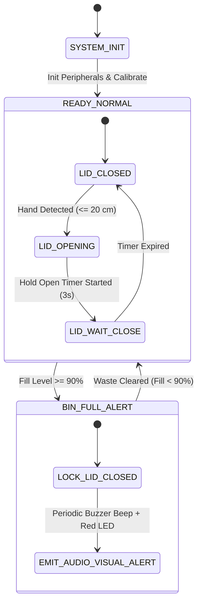

# System Design Document: Smart Dustbin Embedded System

## 1. System Overview
The Smart Dustbin is an autonomous, dual-sensor embedded system designed for public and institutional sanitation management. It provides:
1. **Touchless Lid Actuation**: Prevents direct physical contact using ultrasonic time-of-flight proximity detection.
2. **Internal Waste Level Monitoring**: Calculates waste fill percentage in real-time.
3. **Smart Alert & Interlock System**: Audio-visual notifications and lid lock-out when capacity reaches $\ge 90\%$.

---

## 2. Hardware Architecture & Block Diagram

```text
+-----------------------------------------------------------------------------------+
|                                  POWER SUPPLY (5V DC)                             |
+-----------------------------------------------------------------------------------+
                                          |
                                          v
+-----------------------------------------------------------------------------------+
|                                  MICROCONTROLLER                                  |
|                            (Arduino UNO / ATmega328P)                             |
|                                                                                   |
|  +-------------------+       +-----------------------+       +-----------------+  |
|  | Hand Distance     |       | Control Logic Engine  |       | Output Driver   |  |
|  | Timing Subsystem  | ----> | - Distance Filter     | ----> | - Servo PWM     |  |
|  +-------------------+       | - Fill % Math         |       | - GPIO High/Low |  |
|                              | - State Machine       |       | - UART Stream   |  |
|  +-------------------+       | - Safety Interlock    |       +-----------------+  |
|  | Level Distance    | ----> |                       |                            |
|  | Timing Subsystem  |       +-----------------------+                            |
|  +-------------------+                                                            |
+-----------------------------------------------------------------------------------+
         ^              ^                                      |       |       |
         |              |                                      |       |       |
+----------------+ +----------------+                          |       |       |
| Hand HC-SR04   | | Level HC-SR04  |                          v       v       v
| Ultrasonic     | | Ultrasonic     |                    +-------+ +-----+ +--------+
| (D9-Trig,      | | (D6-Trig,      |                    | Servo | | Buz | | Status |
|  D10-Echo)     | |  D7-Echo)      |                    | (D5)  | | (D4)| | LEDs   |
+----------------+ +----------------+                    +-------+ +-----+ |(D12,13)|
                                                                           +--------+
```

---

## 3. State Transition Model (FSM)



---

## 4. Subsystem Specifications

| Subsystem | Components | Update Interval | Interface |
|---|---|---|---|
| Hand Proximity | HC-SR04 Ultrasonic | 100 ms | Digital GPIO (Trig/Echo Pulse) |
| Waste Level Depth | HC-SR04 Ultrasonic | 400 ms | Digital GPIO (Trig/Echo Pulse) |
| Lid Actuator | SG90 / MG995 Micro Servo | Event-driven | PWM (Timer1/Timer2 ~50Hz) |
| Acoustic Alert | 5V Active Buzzer | 2000 ms periodic pulse | Digital GPIO |
| Visual Telemetry | Green (Normal), Red (Full) LEDs | Real-time | Digital GPIO |
| Serial Telemetry | Hardware UART | 1000 ms | 9600 Baud Serial Stream |
